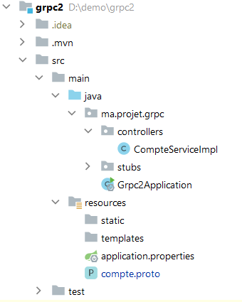
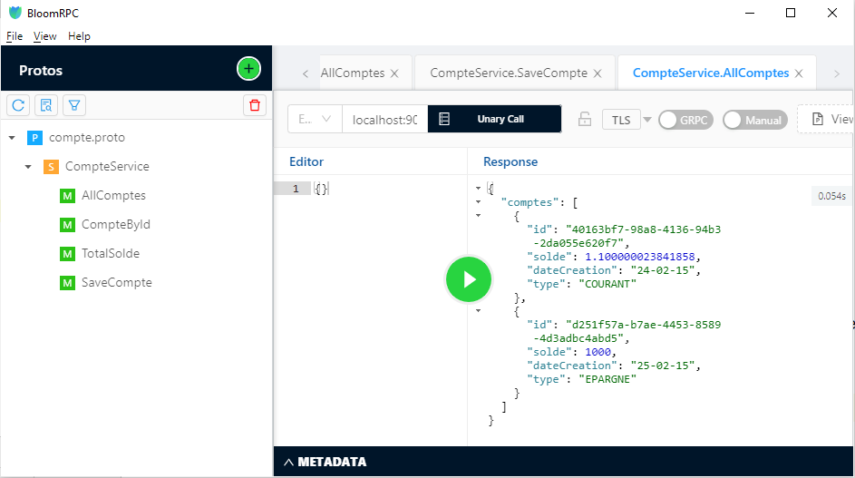

# TP 18 : Implémentation d'un Service gRPC avec Spring Boot

## 🎯 Objectif

Développer un service gRPC en utilisant **Spring Boot** pour gérer des **comptes bancaires** avec les opérations CRUD (consultation, création, mise à jour).

## 📋 Architecture



### Stack Technologique

- **Spring Boot** : Framework principal
- **gRPC** : Communication RPC haute performance
- **Protocol Buffers** : Sérialisation des données
- **H2 Database** : Base de données en mémoire
- **Spring Data JPA** : Persistence des données
- **BloomRPC** : Client gRPC pour les tests

---

## 📁 Structure du Projet

```
TP18-gRPC-Service/
├── src/main/
│   ├── java/ma/projet/grpc/
│   │   ├── controllers/
│   │   │   └── CompteServiceImpl.java
│   │   ├── entities/
│   │   │   └── Compte.java
│   │   ├── repositories/
│   │   │   └── CompteRepository.java
│   │   ├── services/
│   │   │   └── CompteService.java
│   │   └── Grpc2Application.java
│   ├── proto/
│   │   └── CompteService.proto
│   └── resources/
│       └── application.properties
├── pom.xml
└── README.md
```

---

## 🚀 Étape 1 : Configuration Maven

### pom.xml

Le fichier `pom.xml` contient toutes les dépendances nécessaires pour gRPC, Protobuf et Spring Boot.

**Dépendances clés:**

| Dépendance | Version | Rôle |
|------------|---------|------|
| `protobuf-java` | 3.22.0 | Messages Protobuf |
| `grpc-netty-shaded` | 1.53.0 | Transport réseau |
| `grpc-protobuf` | 1.53.0 | Génération stubs |
| `grpc-stub` | 1.53.0 | Classes client/serveur |
| `grpc-server-spring-boot-starter` | 3.1.0.RELEASE | Intégration Spring Boot |

---

## 📝 Étape 2 : Définition Protobuf

### CompteService.proto

Le fichier `.proto` définit le contrat du service gRPC.

**Messages principaux:**

- `Compte` : Représente un compte bancaire
- `TypeCompte` : Enum (COURANT, EPARGNE)
- `SoldeStats` : Statistiques (count, sum, average)

**Services RPC:**

1. **AllComptes** : Récupère tous les comptes
2. **CompteById** : Récupère un compte par ID
3. **TotalSolde** : Calcule les statistiques
4. **SaveCompte** : Crée/met à jour un compte

---

## 💻 Étape 3 : Implémentation Service gRPC

### CompteServiceImpl.java

```java
@GrpcService
public class CompteServiceImpl extends CompteServiceGrpc.CompteServiceImplBase {
    private final CompteService compteService;
    
    // Implémentation des 4 méthodes RPC
}
```

**Annotation `@GrpcService`** : Enregistre automatiquement le service gRPC dans Spring Boot.

### Méthodes Implémentées

| Méthode | Description | Retour |
|---------|-------------|--------|
| `allComptes()` | Liste tous les comptes | `GetAllComptesResponse` |
| `compteById()` | Recherche par ID | `GetCompteByIdResponse` |
| `totalSolde()` | Calcule stats soldes | `GetTotalSoldeResponse` |
| `saveCompte()` | Crée un compte | `SaveCompteResponse` |

---

## 🗄️ Étape 4 : Couche Persistance

### Entité JPA : Compte.java

```java
@Entity
public class Compte {
    @Id
    @GeneratedValue(strategy = GenerationType.AUTO)
    private String id;
    private float solde;
    private String dateCreation;
    private String type; // COURANT ou EPARGNE
}
```

### Repository : CompteRepository.java

```java
public interface CompteRepository extends JpaRepository<Compte, String> {
    // Méthodes héritées de JpaRepository
}
```

### Service : CompteService.java

```java
@Service
public class CompteService {
    private final CompteRepository compteRepository;
    
    public List<Compte> findAllComptes() {
        return compteRepository.findAll();
    }
    
    public Compte saveCompte(Compte compte) {
        return compteRepository.save(compte);
    }
}
```

---

## ⚙️ Étape 5 : Configuration

### application.properties

```properties
# gRPC Server Configuration
grpc.server.port=9090

# H2 Database Configuration
spring.datasource.url=jdbc:h2:mem:testdb
spring.datasource.driver-class-name=org.h2.Driver
spring.datasource.username=sa
spring.datasource.password=

# JPA Configuration
spring.jpa.database-platform=org.hibernate.dialect.H2Dialect
spring.jpa.hibernate.ddl-auto=create-drop
spring.jpa.show-sql=true

# H2 Console (optionnel)
spring.h2.console.enabled=true
```

---

## 🧪 Étape 6 : Tests avec BloomRPC



### Installation BloomRPC

1. Télécharger depuis [GitHub](https://github.com/bloomrpc/bloomrpc)
2. Installer l'application

### Configuration

1. **File → Import Protobuf**
2. Sélectionner `CompteService.proto`
3. Configurer l'adresse: `localhost:9090`

### Test AllComptes

**Request:**
```json
{}
```

**Response:**
```json
{
  "comptes": [
    {
      "id": "40163bf7-98a8-4136-94b3-2da055e620f7",
      "solde": 1.100000023841858,
      "dateCreation": "24-02-15",
      "type": "COURANT"
    },
    {
      "id": "d251f57a-b7ae-4453-8589-4d3adbc4abd5",
      "solde": 1000,
      "dateCreation": "25-02-15",
      "type": "EPARGNE"
    }
  ]
}
```

### Test SaveCompte

**Request:**
```json
{
  "compte": {
    "solde": 5000,
    "dateCreation": "2024-12-07",
    "type": "COURANT"
  }
}
```

**Response:**
```json
{
  "compte": {
    "id": "generated-uuid",
    "solde": 5000,
    "dateCreation": "2024-12-07",
    "type": "COURANT"
  }
}
```

---

## 📊 Comparaison gRPC vs REST

| Critère | gRPC | REST |
|---------|------|------|
| **Format** | Protocol Buffers (binaire) | JSON (texte) |
| **Performance** | ⚡ Très rapide | Moyen |
| **Taille messages** | Compact | Verbeux |
| **Streaming** | ✅ Bidirectionnel | ❌ Limité |
| **Browser** | ❌ Nécessite proxy | ✅ Natif |
| **Typage** | ✅ Fort | ❌ Faible |

---

## 📝 Étapes d'Exécution

### 1. Compilation du projet

```bash
mvn clean install
```

### 2. Lancer l'application

```bash
mvn spring-boot:run
```

### 3. Vérifier le démarrage

```
gRPC Server started, listening on address: 0.0.0.0, port: 9090
```

### 4. Tester avec BloomRPC

- Charger `CompteService.proto`
- Connexion à `localhost:9090`
- Exécuter les méthodes

---

## 🔧 Génération des Stubs

Les classes gRPC sont générées automatiquement par le plugin Maven Protobuf :

```xml
<build>
    <plugins>
        <plugin>
            <groupId>org.xolstice.maven.plugins</groupId>
            <artifactId>protobuf-maven-plugin</artifactId>
            <version>0.6.1</version>
            <configuration>
                <protocArtifact>com.google.protobuf:protoc:3.21.12:exe:${os.detected.classifier}</protocArtifact>
                <pluginId>grpc-java</pluginId>
                <pluginArtifact>io.grpc:protoc-gen-grpc-java:1.53.0:exe:${os.detected.classifier}</pluginArtifact>
            </configuration>
            <executions>
                <execution>
                    <goals>
                        <goal>compile</goal>
                        <goal>compile-custom</goal>
                    </goals>
                </execution>
            </executions>
        </plugin>
    </plugins>
</build>
```

**Classes générées:**
- `Compte.java`
- `CompteServiceGrpc.java`
- `GetAllComptesRequest.java`
- `GetAllComptesResponse.java`
- etc.

---

## 🐛 Dépannage

### Port 9090 déjà utilisé

```properties
grpc.server.port=9091
```

### Stubs non générés

```bash
mvn clean compile
```

### Erreur H2 Database

Vérifier `application.properties` :
```properties
spring.jpa.hibernate.ddl-auto=create-drop
```

---

## 📚 Ressources

- [gRPC Official](https://grpc.io/)
- [Protocol Buffers](https://protobuf.dev/)
- [Spring Boot gRPC](https://github.com/yidongnan/grpc-spring-boot-starter)
- [BloomRPC](https://github.com/bloomrpc/bloomrpc)

---

## 👨‍💻 Auteur

**Imad ADAOUMOUM**

## 📄 License

Ce projet est réalisé dans un cadre académique.
